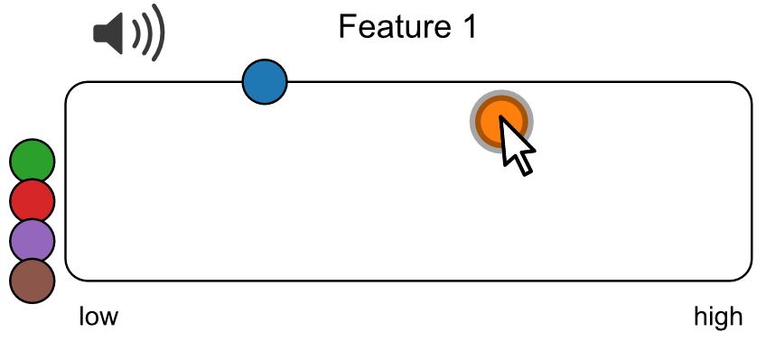
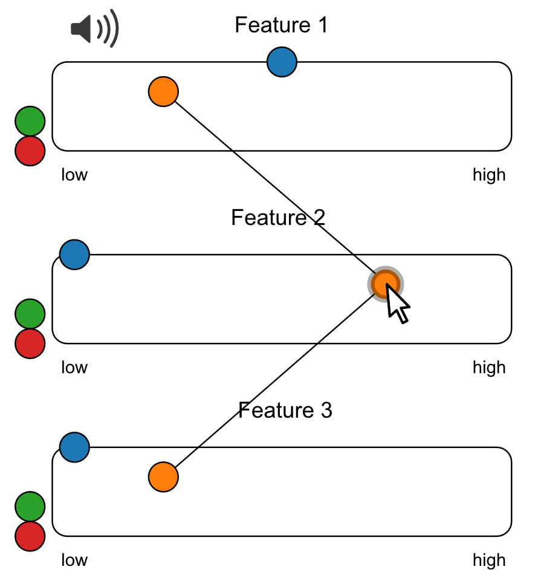
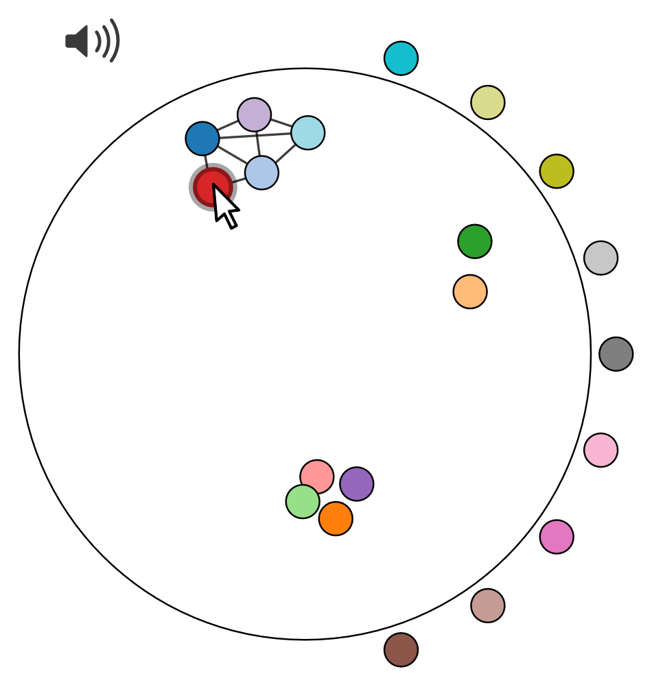

# Perception et Design Sonores
{:.no_toc}

     
# Tasks / Plugins
{:.no_toc}

TABLE OF CONTENTS

* TOC
{:toc}

## Psychoacoustic tasks

Psychophysics studies the mapping from physical attributes of the stimuli (e.g. sound level), to attributes of the corresponding sensations (e.g., loudness). 
Classical psychophysical methods are often concerned with the measurement of two sensory quantities: the absolute
threshold, i.e., the smallest or highest detectable value of a stimulus attribute, and the differential threshold, i.e., the smallest dis-
criminable difference in a stimulus attribute.

### Staircase method

[<b>[Code]</b>](https://github.com/MatthieuFra/jsPsychPDS/tree/main/demos-tasks/staircase) [<b>[Demo]</b>](./demos-tasks/staircase/experiment-demo.html)

  
Visualize code :

  <code>
  
    var preloadB = {
      
      type: jsPsychPreload,
      audio: [
        "audio/1000_-20dBFS_-1.wav",
        "audio/1000_-20dBFS_-2.wav",
        "audio/1000_-20dBFS_-3.wav",
        "audio/1000_-20dBFS_-4.wav",
        "audio/1000_-20dBFS_-5.wav",
        "audio/1000_-20dBFS_-6.wav",
        "audio/1000_-20dBFS_-7.wav",
        "audio/1000_-20dBFS_-8.wav",
        "audio/1000_-20dBFS_-9.wav",
        "audio/1000_-20dBFS_-10.wav",
        "audio/1000_-20dBFS_-11.wav",
        "audio/1000_-20dBFS_-12.wav",
        "audio/1000_-20dBFS_-13.wav",
        "audio/1000_-20dBFS_-14.wav",
        "audio/1000_-20dBFS_-15.wav",
        "audio/1000_-20dBFS_-16.wav",
        "audio/1000_-20dBFS_-17.wav",
        "audio/1000_-20dBFS_-18.wav",
        "audio/1000_-20dBFS_-19.wav",
        "audio/1000_-20dBFS_-20.wav",
        "audio/1000_-20dBFS_-21.wav",
        "audio/1000_-20dBFS_-22.wav",
        "audio/1000_-20dBFS_-23.wav",
        "audio/1000_-20dBFS_-24.wav",
        "audio/1000_-20dBFS_-25.wav",
        "audio/1000_-20dBFS_-26.wav",
        "audio/1000_-20dBFS_-27.wav",
        "audio/1000_-20dBFS_-28.wav",
        "audio/1000_-20dBFS_-29.wav",
        "audio/1000_-20dBFS_-30.wav",
        "audio/1000_-20dBFS_-31.wav",
        "audio/1000_-20dBFS_-32.wav",
        "audio/1000_-20dBFS_-33.wav",
        "audio/1000_-20dBFS_-34.wav",
        "audio/1000_-20dBFS_-35.wav",
        "audio/1000_-20dBFS_-36.wav",
        "audio/1000_-20dBFS_-37.wav",
        "audio/1000_-20dBFS_-38.wav",
        "audio/1000_-20dBFS_-39.wav",
        "audio/1000_-20dBFS_-40.wav",
        "audio/1000_-20dBFS_-41.wav",
        "audio/1000_-20dBFS_-42.wav",
        "audio/1000_-20dBFS_-43.wav",
        "audio/1000_-20dBFS_-44.wav",
        "audio/1000_-20dBFS_-45.wav",
        "audio/1000_-20dBFS_-46.wav",
        "audio/1000_-20dBFS_-47.wav",
        "audio/1000_-20dBFS_-48.wav",
        "audio/1000_-20dBFS_-49.wav",
        "audio/1000_-20dBFS_-50.wav",
        "audio/1000_-20dBFS_-51.wav",
        "audio/1000_-20dBFS_-52.wav",
        "audio/1000_-20dBFS_-53.wav",
        "audio/1000_-20dBFS_-54.wav",
        "audio/1000_-20dBFS_-55.wav",
        "audio/1000_-20dBFS_-56.wav",
        "audio/1000_-20dBFS_-57.wav",
        "audio/1000_-20dBFS_-58.wav",
        "audio/1000_-20dBFS_-59.wav",
        "audio/1000_-20dBFS_-60.wav",
        "audio/1000_-20dBFS_-61.wav",
        "audio/1000_-20dBFS_-62.wav",
        "audio/1000_-20dBFS_-63.wav",
        "audio/1000_-20dBFS_-64.wav",
        "audio/1000_-20dBFS_-65.wav",
        "audio/1000_-20dBFS_-66.wav",
        "audio/1000_-20dBFS_-67.wav",
        "audio/1000_-20dBFS_-68.wav",
        "audio/1000_-20dBFS_-69.wav",
        "audio/1000_-20dBFS_-70.wav",
        "audio/1000_-20dBFS_-71.wav",
        "audio/1000_-20dBFS_-72.wav",
        "audio/1000_-20dBFS_-73.wav",
        "audio/1000_-20dBFS_-74.wav",
        "audio/1000_-20dBFS_-75.wav",
        "audio/1000_-20dBFS_-76.wav",
        "audio/1000_-20dBFS_-77.wav",
        "audio/1000_-20dBFS_-78.wav",
        "audio/1000_-20dBFS_-79.wav",
        "audio/1000_-20dBFS_-80.wav",
        "audio/1000_-20dBFS_-81.wav",
        "audio/1000_-20dBFS_-82.wav",
        "audio/1000_-20dBFS_-83.wav",
        "audio/1000_-20dBFS_-84.wav",
        "audio/1000_-20dBFS_-85.wav",
        "audio/1000_-20dBFS_-86.wav",
        "audio/1000_-20dBFS_-87.wav",
        "audio/1000_-20dBFS_-88.wav",
        "audio/1000_-20dBFS_-89.wav",
        "audio/1000_-20dBFS_-90.wav",
        "audio/1000_-20dBFS_-91.wav",
        "audio/1000_-20dBFS_-92.wav",
        "audio/1000_-20dBFS_-93.wav",
        "audio/1000_-20dBFS_-94.wav",
        "audio/1000_-20dBFS_-95.wav",
        "audio/1000_-20dBFS_-96.wav",
        "audio/1000_-20dBFS_-97.wav",
        "audio/1000_-20dBFS_-98.wav",
        "audio/1000_-20dBFS_-99.wav",
        "audio/1000_-20dBFS_-100.wav",
    
     
      ]
    };
    
 
    
    var chooseFreq;
    var chooseMethod;
    
    var configExpB = {
  type: jsPsychSurveyMultiChoice,
  questions: [
    {
      prompt: "Choisissez la <b>fréquence</b> du stimuli <i>(Hz)</i> (not implemented yet)", 
      name: 'Freq', 
      options: [200, 500, 1000, 5000], 
      required: true
    }, 
    {
      prompt: "Méthode adaptative (not implemented yet)", 
      name: 'Method', 
      options: ['Standard staircase', '3 up 2 down', 'Method 3', 'Method 4', 'Method 5'], 
      required: false
    }
  ],
  on_finish: function(){
    chooseFreq = jsPsych.data.getLastTrialData().trials[0].response.Freq
    chooseMethod = jsPsych.data.getLastTrialData().trials[0].response.Method
    console.log(`Freq = ${chooseFreq} Method = ${chooseMethod}`)
  }
};

  
    
    var instructionsB = {
    type: jsPsychInstructions,
    pages: [
    'Nous allons diffuser plusieurs sons, les uns à la suite des autres.',
    'Vous devez dire si vous avez entendu le son joué ou non. ',
    ],
    button_label_next: "Continuer",
    button_label_previous: "Retour",
    show_clickable_nav: true,
    post_trial_gap: 100,
}
 
    
      var startExpB = {
      
      type: jsPsychHtmlButtonResponse,
      stimulus: "
Cliquez sur continuer pour lancer la tache.

",
      choices: ['Continuer'],
      post_trial_gap: 1000,
    };
    

    var soundHeard;
    var count = 1;
    var witchFreq = 1000 // chooseFreq;
    var initVol = Math.floor(Math.random()*100);
    var volSound = initVol;
    
    var playSound = {
      
       type: jsPsychAudioKeyboardResponse,
       stimulus: function(){
         if(soundHeard === true){
           volSound ++
           console.log("On baisse le son !")
           console.log(`volSound = -${volSound}`)
           return `audio/${witchFreq}_-20dBFS_-${volSound}.wav` 
         } else if(soundHeard === false){
           volSound --
          console.log("On monte le son !")
          console.log(`volSound = -${volSound}`)
           return `audio/${witchFreq}_-20dBFS_-${volSound}.wav`
         } else {
           console.log("Première écoute")
           console.log(`initVol = -${initVol}`)
           return `audio/${witchFreq}_-20dBFS_-${initVol}.wav`
         }
         
       },
       choices: "NO_KEYS",
       prompt: "

",
       trial_ends_after_audio: true,
       response_ends_trial: false,
       response_allowed_while_playing: false,
       post_trial_gap: 10,
    };

      //timeline.push(playSound);
    
    var heardYesNo = {
        type: jsPsychHtmlButtonResponse,
        stimulus: '
Avez-vous entendu le son ?
',
        choices: ['Oui', 'Non'],
        prompt: "

",
        on_finish: function(){
          soundHeard = jsPsych.data.getLastTrialData().trials[0].response
          
          if(soundHeard === 0){
            soundHeard = true
            console.log(`Response: ${soundHeard}`)
            return soundHeard
          } else if(soundHeard === 1){
            soundHeard = false
            console.log(`Response: ${soundHeard}`)
            return soundHeard
          }
        },
        post_trial_gap: 1000,
    };

//    timeline.push(heardYesNo);
    
    var loopTaskB = {
    timeline: [playSound, heardYesNo],
    post_trial_gap: 0,
    on_start: function(){
      
    },
    loop_function: function(){        
      while(count < 10){
        count++
        console.log(`Count is ${count}`)
        return true
      }
    },

  }
  
timeline.push(loopTaskB);

  
</code>
                        

     

> A variation of the method of limits in which stimuli are presented in ascending and descending order. When the observer’s response changes, the direction of the stimulus sequence is reversed. Differents methods of changing the stimuli can be used. 

### Sonic egalisation

[<b>[Code]</b>](https://github.com/MatthieuFra/jsPsychPDS/tree/main/demos-tasks/sonic-egalisation) [<b>[Demo]</b>](./demos-tasks/sonic-egalisation/experiment-demo.html)

> A task designed to egalise sonic between stimuli before making an perceptual evaluation.

## Classicals paradigms for audio evaluation

<i>Partly based on Sonic Interaction Design (Franovic & Serafin, 2012) especially Chapter 5 <b>Perceptual evalutation of sound-producing objects</b> (Giordano, Susini, Bresin)</i>

### Identification and categorization

[<b>[Code]</b>](https://github.com/MatthieuFra/jsPsychPDS/tree/main/demos-tasks/identification-categorization) [<b>[Demo]</b>](./demos-tasks/identification-categorization/experiment-demo.html)

> Identification and categorization experiments allow the designer to assess the
mapping from a set of display configurations to a set of meaningful verbal labels (e.g.,
identifications of naturalistic events but also mapping of stimulus set onto emotion-
related categories such as “sad” or “happy”).
During an identification/categorization experiment, participants are asked to assign
each of the stimuli to one among a set of pre-specified verbal labels (e.g., “is this
sound a violin, a guitar, or a flute tone?”). (Giordano, B., Susini, P., & Bresin, R., 2012)

### Scaling and rating

[<b>[Code]</b>](https://github.com/MatthieuFra/jsPsychPDS/tree/main/demos-tasks/scaling-rating) [<b>[Demo]</b>](./demos-tasks/scaling-rating/experiment-demo.html)

> Scaling methods allow to measure the psychophysical function, i.e., the function
that relates physical attributes of the stimuli to sensory continua (e.g., sound level
and perceived loudness)2. We can distinguish between two families of scaling methods:
partition and ratio scaling.
In a partition scaling experiment, participants are asked to divide a target physical
dimension in perceptually equivalent intervals. 
The methods of ratio scaling and magnitude scaling produce a mapping from the
sensory continuum to a numeric continuum. 
In a ratio estimation task, participants estimate numerically the ratio between the sensory magnitude of two stimuli. 
In a ratio production task, participants adjust the physical properties of a stimulus so that the ratio of its sensory
magnitude to that of a reference stimulus equals a prespecified number. 
With magnitude estimation, participants assign a number to the sensory magnitude of the first presented stimulus, and estimate numerically the sensory magnitude of subsequent stimuli based on the number assigned to the first stimulus. 
With magnitude production, the sensory magnitude for a reference stimulus is assigned a numerical value, and the participant is asked to
manipulate the physical properties of a new stimulus so that its sensory magnitude
equals a given number. 
The rating method can be conceived as a variant of the magnitude estimation
method : participants estimate the sensory magnitude by choosing an
integer number within a prespecified range. (Giordano, B., Susini, P., & Bresin, R., 2012)

### Dissimilarity estimation

[<b>[Code]</b>](https://github.com/MatthieuFra/jsPsychPDS/tree/main/demos-tasks/dissimilarity) [<b>[Demo]</b>](./demos-tasks/dissimilarity/experiment-demo.html)

> The goal of the dissimilarity ratings method, also known as paired comparisons
method, is to measure perceptual distances between the stimuli: very similar stimuli
are separated by a short perceptual distance; very different or dissimilar stimuli are
separated by a long perceptual distance. On each trial of a dissimilarity ratings experiment, participants are presented with two stimuli and are asked to rate how dissimilar they are on a “very similar” to “very dissimilar” scale. (Giordano, B., Susini, P., & Bresin, R., 2012)

### Sorting

[<b>[Code]</b>](https://github.com/MatthieuFra/jsPsychPDS/tree/main/demos-tasks/sorting) [<b>[Demo]</b>](./demos-tasks/sorting/experiment-demo.html)

> All sorting tasks require participants to create groups of stimuli. The design of a sorting experiment requires two fundamental decisions
firstly concerning the criteria participants should follow when creating the groups of
stimuli and secondly concerning how many groups of stimuli the participants should
create. 
In the free sorting variant , the experimenter does not specify the number
of groups, and leaves the decision up to the participant.
With constrained sorting the number of groups is instead specified by
the experimenter. 
The participants can receive specific instructions about the criteria they should follow to group the stimuli together, or not. 
When this is the case, sorting methods bear a strong resemblance to the categorization task, and if this isn't the case, the sorting
task is the categorization analog of dissimilarity ratings. (Giordano, B., Susini, P., & Bresin, R., 2012)

### Verbalization

[<b>[Code]</b>](https://github.com/MatthieuFra/jsPsychPDS/tree/main/demos-tasks/verbalization) [<b>[Demo]</b>](./demos-tasks/verbalization/experiment-demo.html)

> Verbalization tasks can be used to explore qualitatively the perceptually-relevant
attributes of sound-interactive events: do users focus on the characteristic of the
sound signal, on the characteristic of the source or on more abstract symbolic contents associated
with the sound event ? 
Verbalization can be free, or constrained. (Giordano, B., Susini, P., & Bresin, R., 2012)

### Descriptors sound pairs comparison

[<b>[Code]</b>](https://github.com/MatthieuFra/jsPsychPDS/tree/main/demos-tasks/descriptors-sound-pairs-comparison) [<b>[Demo]</b>](./demos-tasks/descriptors-sound-pairs-comparison/experiment-demo.html)

> Participants choose between two sounds in a pair wich one seems more adequately reflecting the descriptor associated.
Example : Wich sound is the most <b>Low</b> for you : A or B ? 
All the pairs without mutations are tested for all descriptors. (Giordano, B., Susini, P., & Bresin, R., 2012)

### Semantic differential

[<b>[Code]</b>](https://github.com/MatthieuFra/jsPsychPDS/tree/main/demos-tasks/semantic-differential) [<b>[Demo]</b>](./demos-tasks/semantic-differential/experiment-demo.html)

> The semantic differential method can be conceived as a multidimensional extension
of the ratings method seen previously. 
The main difference between the two methods indeed stands in the number of psychological or perceptual attributes simultaneously
evaluated by the experiment participant: one for the latter, more than one for the
former. 
In the most popular variant of the semantic differential method, participants rate each stimulus along several bipolar scales defined by opposing semantic descriptors. 
Each bipolar scale is usually divided in an odd number of intervals (e.g., seven). (Giordano, B., Susini, P., & Bresin, R., 2012)

### Preference estimation

<b><i>Paired preference comparison task</i></b>

[<b>[Code]</b>](https://github.com/MatthieuFra/jsPsychPDS/tree/main/demos-tasks/preference-estimation) [<b>[Demo]</b>](./demos-tasks/preference-estimation/experiment-demo.html)

<b><i>Preference ranking task</i></b>

<b>TO ADD / NOT CURRENTLY AVAILABLE</b>

[<b>[Code]</b>](https://github.com/MatthieuFra/jsPsychPDS/tree/main/demos-tasks/preference-estimation) [<b>[Demo]</b>](./demos-tasks/preference-estimation/experiment-demo.html)

<b><i>Preference ratings</i></b>

<b>TO ADD / NOT CURRENTLY AVAILABLE</b>

[<b>[Code]</b>](https://github.com/MatthieuFra/jsPsychPDS/tree/main/demos-tasks/preference-estimation) [<b>[Demo]</b>](./demos-tasks/preference-estimation/experiment-demo.html)

> Preference data can be collected with various experimental methods: 
In a paired preference comparison task, participants are presented with all the possible pairs of stimuli, one at a time,
and are asked to choose which of the two they prefer. 
In a preference ranking task, participants are presented with all of the stimuli at once, and are asked to arrange
them from the least to the most preferred. 
With preference ratings, participants rate their preference for each of the stimuli on a categorical or continuous scale. 
(Giordano, B., Susini, P., & Bresin, R., 2012)

### Continuous audio evaluation

<b>TO ADD / NOT CURRENTLY AVAILABLE</b>

[<b>[Code]</b>](https://github.com/MatthieuFra/jsPsychPDS/tree/main/demos-tasks/continuous-evaluation) [<b>[Demo]</b>](./demos-tasks/continuous-evaluation/experiment-demo.html)

> Participants in a continuous evaluation experiment are asked to repeatedly judge
some perceptual/cognitive attribute as the stimulus unfolds in time (e.g., a musical
composition or a soundscape).
This jsPsych implementation use keyboards responses that can be pressed during the listening of the stimulus. (Giordano, B., Susini, P., & Bresin, R., 2012)

## Other tasks

### Best-Worth scaling (BWS)

[<b>[Code]</b>](https://github.com/MatthieuFra/jsPsychPDS/tree/main/demos-tasks/bws) [<b>[Demo]</b>](./demos-tasks/bws/experiment-demo.html)

> Best–worst scaling (BWS) techniques involve choice modelling. 
Survey respondents are shown a subset of items from a master list and are asked to indicate the best and worst items (or most and least important, or most and least appealing, etc.). The task is repeated a number of times, varying the particular subset of items in a systematic way, typically according to a statistical design.

### Sustain Attention Reaction Task (SART)

[<b>[Code]</b>](https://github.com/MatthieuFra/jsPsychPDS/tree/main/demos-tasks/sart) [<b>[Demo]</b>](./demos-tasks/sart/experiment-demo.html)

> An implementation of the SART Task described [HERE](https://www.psytoolkit.org/experiment-library/sart.html#refs) and originally designed by Robertson and colleagues. (Robertson & Andrade, 1997)

### Irrelevant Sound Effect (ISE)

[<b>[Code]</b>](https://github.com/MatthieuFra/jsPsychPDS/tree/main/demos-tasks/ise) [<b>[Demo]</b>](./demos-tasks/ise/experiment-demo.html)

> A jsPsych implementation of a task to test sounds to disrupts immediate serial-recall, for attentional capture effect.

### Paced Visual Serial Addition Task

[<b>[Code]</b>](https://github.com/MatthieuFra/jsPsychPDS/tree/main/demos-tasks/paced-visual-serial-addition-task) [<b>[Demo]</b>](./demos-tasks/paced-visual-serial-addition-task/experiment-demo.html)

> In the Paced Visual Serial Addition Test, participant has to add the last digit presented to the preceding digit which presented on the screen of the computer then click on the answer. This is a jsPsych implementation of the task initially described by [(Hamidi & Rohi, 2011)](https://www.sciencedirect.com/science/article/pii/S1877050910003996). 

## Self-Report Plugins

### Sound system used

[<b>[Code]</b>](https://github.com/MatthieuFra/jsPsychPDS/tree/main/demos-tasks/sound-system) [<b>[Demo]</b>](./demos-tasks/sound-system/experiment-demo.html)

> This self-report survey is used to know witch wich sound system participants are listening the sound. The answer is saved to data, it can also be a criteria to be able to pass the experiment.

### Demographics informations

[<b>[Code]</b>](https://github.com/MatthieuFra/jsPsychPDS/tree/main/demos-tasks/demographics) [<b>[Demo]</b>](./demos-tasks/demographics/experiment-demo.html)

> Classic survey to get Demographics informations.

## Utilities

### Introduction & instructions

[<b>[Code]</b>](https://github.com/MatthieuFra/jsPsychPDS/tree/main/demos-tasks/introduction-instructions) [<b>[Demo]</b>](./demos-tasks/introduction-instructions/experiment-demo.html)

> This code-template is to be used to design experiment within the team. It contain the visual chart used and the structure of instructions commonly used.

### Ending experiment

[<b>[Code]</b>](https://github.com/MatthieuFra/jsPsychPDS/tree/main/demos-tasks/end-experiment) [<b>[Demo]</b>](./demos-tasks/end-experiment/experiment-demo.html)

> This code-template is to be used to design experiment within the team. It contain the visual chart used and the structure of instructions commonly use for the end of the experiments. It contain a survey text and a mail to contact the researcher if needed. 

### Random subjet number generator 

[<b>[Code]</b>](https://github.com/MatthieuFra/jsPsychPDS/tree/main/demos-tasks/random-subject-generator) [<b>[Demo]</b>](./demos-tasks/random-subject-generator/experiment-demo.html)

> This code is using the <i>Call function</i> plugin to generate a random subjet number wich is saved in every row of data.

### Pairs generator 

[<b>[Code]</b>](https://github.com/MatthieuFra/jsPsychPDS/tree/main/demos-tasks/pairs-generator) [<b>[Demo]</b>](./demos-tasks/pairs-generator/experiment-demo.html)

> The pairs generator is a useful module implemented in jsPsych in order to create from an Array Q with n elements, an other Array Q' with all the possible pairs between Q elements, without mutations ([a, b] and [b, a] are considered the same, and there's no [a, a]). 
  It's coded using ES6 syntax and it's used by all the experiments that need pairs and to perform permutations with stimuli.

<i>
Example :
Q = ['a', 'b', 'c', 'd', 'e'];

Q' = [[['a','b'], ['a','c'], ['a','d'],['a','e'],['b','c'],['b','d'],['b','e'],['c','d'],['c','e'],['d','e']];

### Consent forms

[<b>[Code]</b>](https://github.com/MatthieuFra/jsPsychPDS/tree/main/demos-tasks/consent-form) [<b>[Demo]</b>](./demos-tasks/consent-form/experiment-demo.html)

> The consent forms for online experiments in the PDS team and STMS lab.

## Audio utilities 

### Audio test Headphones

[<b>[Code]</b>](https://github.com/MatthieuFra/jsPsychPDS/tree/main/demos-tasks/audio-test-headphones) [<b>[Demo]</b>](./demos-tasks/audio-test-headphones/experiment-demo.html)

> An implementation in jsPsych of a way to check if the participant is wearing an headphone.
Listeners judge which of three pure tones is quietest, with one of the tones presented 180° out of phase across the stereo channels. This task is intended to be easy over headphones but difficult over loudspeakers due to phase-cancellation
Adapted from [(Woods, 2017)](https://link.springer.com/article/10.3758/s13414-017-1361-2).

### Audio test Loudness

[<b>[Code]</b>](https://github.com/MatthieuFra/jsPsychPDS/tree/main/demos-tasks/audio-test-loudness) [<b>[Demo]</b>](./demos-tasks/audio-test-loudness/experiment-demo.html)

> Small experimental block to made participants listening to a pink noise and adjuste their hearing volume to be confortable.

### Audio test Frequencies

[<b>[Code]</b>](https://github.com/MatthieuFra/jsPsychPDS/tree/main/demos-tasks/audio-test-frequencies) [<b>[Demo]</b>](./demos-tasks/audio-test-frequencies/experiment-demo.html)

> A task designed to get a rough idea of the frequency range that each participant is able to hear.

### Audio test Stereo

[<b>[Code]</b>](https://github.com/MatthieuFra/jsPsychPDS/tree/main/demos-tasks/audio-test-stereo) [<b>[Demo]</b>](./demos-tasks/audio-test-stereo/experiment-demo.html)

> A quick test to check if participant can hear in stereo and if headphones left and right side are correctly playing.

## Other ressources

### Psychoacoustics plugin

[<b>[Original website]</b>](https://jspsychophysics.hes.kyushu-u.ac.jp/) [<b>[GitHub]</b>](https://github.com/kurokida/jspsych-psychophysics)

> The jspsych-psychophysics plugin is developed for conducting online/Web-based psychophysical experiments using jsPsych. [(Kuroki, 2021)](https://link.springer.com/article/10.3758/s13428-020-01445-w)

### Audio tokens plugin

[<b>[Original website]</b>](https://psyarxiv.com/3j58q/) [<b>[GitHub]</b>](https://github.com/pwdonh/audio_tokens)

> A Javascript toolbox to perform online rating studies with auditory material. The main feature of the toolbox is that audio samples are associated with visual tokens on the screen that control audio playback and can be manipulated depending on the type of rating. This allows the collection of single- and multi-dimensional feature ratings, as well as categorical and similarity ratings.  [(Donhauser & Klein, 2021)](https://psyarxiv.com/3j58q/)

     
Some screenshots to illustrate : 

- Single feature rating

- Multiple feature rating

- Sorting

And more, like categorization, constrained or free, etc.

You can try the tools interactively [here](https://peterdonhauser.com/post/audio-ratings/).
     
     
# References
     
Here's all the references cited in the website.
 
Robertson, I., Manly, T., Andrade, J., Baddeley, B., & Yiend, J. (1997). `Oops!': Performance correlates of everyday attentional failures in traumatic brain injured and normal subjects. Neuropsychologia, 35(6), 747-758. doi: 10.1016/s0028-3932(97)00015-8
 
Kuroki, D. (2020). A new jsPsych plugin for psychophysics, providing accurate display duration and stimulus onset asynchrony. Behavior Research Methods, 53(1), 301-310. doi: 10.3758/s13428-020-01445-w

Woods, K., Siegel, M., Traer, J., & McDermott, J. (2017). Headphone screening to facilitate web-based auditory experiments. Attention, Perception, &Amp; Psychophysics, 79(7), 2064-2072. doi: 10.3758/s13414-017-1361-2

Hamidi, F., & Roohi, N. (2011). Manufacture and Validation of Paced Visual Serial Addition Test (PVSAT) for an Iranian Population. Procedia Computer Science, 3, 138-143. doi: 10.1016/j.procs.2010.12.024

de Leeuw, J. (2014). jsPsych: A JavaScript library for creating behavioral experiments in a Web browser. Behavior Research Methods, 47(1), 1-12. doi: 10.3758/s13428-014-0458-y

Giordano, B., Susini, P., & Bresin, R. (2012). Perceptual evaluation of sound-producing objects. Dans Franinovic K., & Serafin S. (dirs), Sonic interaction design (pp. 171-219), MIT Press
     
     
     

